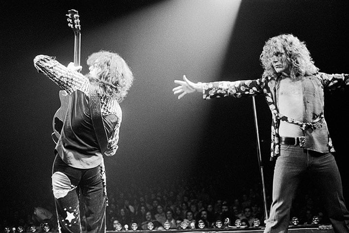

## Notes From a Heavy Sunday

### Every Album Back to Back

### The Goal

We all have unfortunate gaps our personal musical catalogue. Those bands that you've always
like when you heard them but never quite got around to going deep.

For me, Led Zeppelin was one of these bands. Of course, I knew the main songs like _Stairway_
and _Black Dog_.

### Led Zeppelin I - 1969

### Led Zeppelin II - 1969

### Led Zeppelin III - 1970

11:15am

- Led Zeppelin II is hard act to follow.

### Led Zeppelin IV - 1971

### House of the Holy - 1973

#### 1:20pm

- Album titles are fun.
- Lots of good stuff here... a lot of highs.. some spetacular lows.
- _The Crunge_ is a truly odd song. And maybe worst song title of all time? Its got a sort of James Brown funk guitar thing going on.

- Ok the way Jimmy Page keeps asking if anyone's "seen the bridge?" at the end has made this my new favorite song.

- _Rain Song_ is a beautiful track.

- _Dyer Mak'er_ sounds like it could have been written in the 90's!

- Already knew this, but worth repeating - No Quarter is **dooooooope**

## Physcial Graffiti - 1975

## Presence - 1976

## In Through the Out Door - 1979
