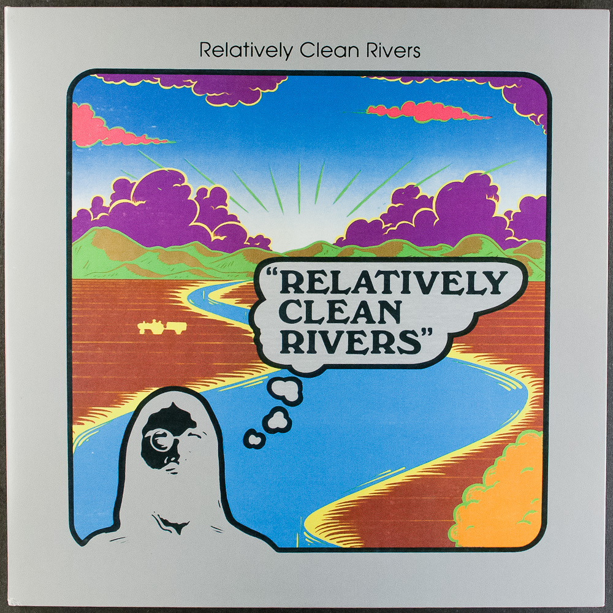
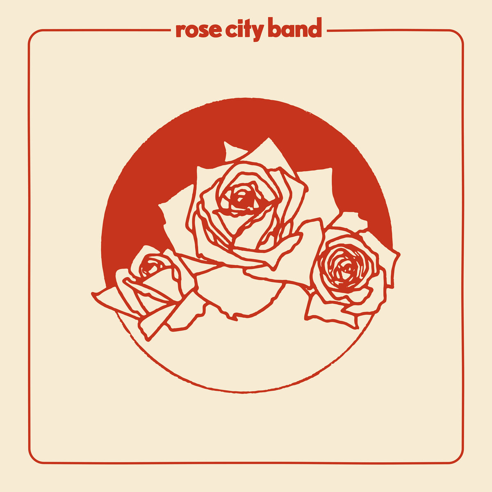
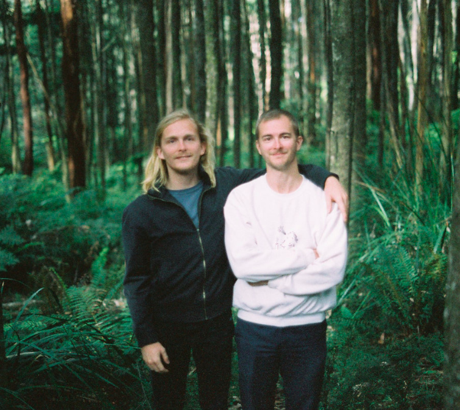
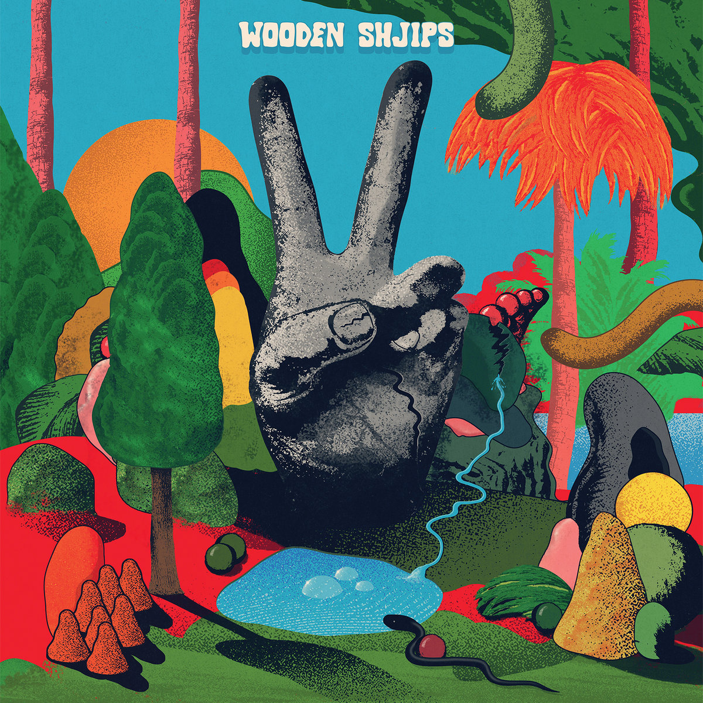
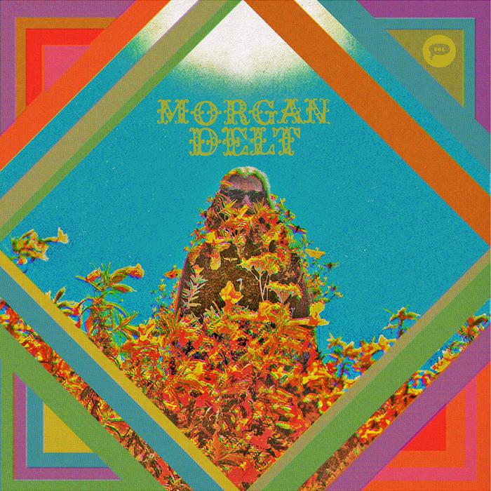

Beyond the Dead is an attempt for a Deadhead to branch out into familiar but unknown territory.

## Relatively Clean Rivers

### 'Journey to the Valley of O'

#### Relatively Clean Rivers (1976)

## Rose City Band

### 'Fear Song'

#### Rose City Band (2019)

## Tonstartssbandht

### 'Breathe'

#### Sorcerer (2017)

## Wooden Shjips

### 'Eclipse'

#### V. (2018)

## Morgan Delt

### 'Barbarian Kings'

#### Morgan Delt (2014)

