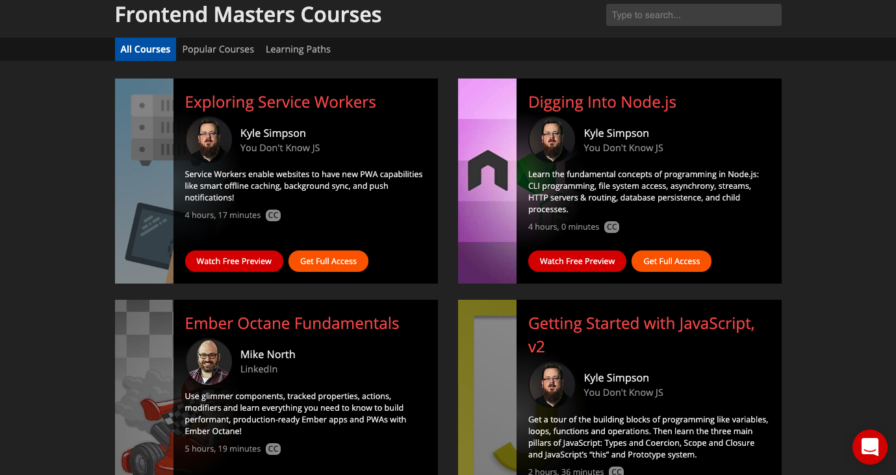

Your time is limited and the web development ecosystem keeps growing.
Just take a look at job specs for entry level web developers
and the amount frameworks, tools, and libraries you will be expected to know
can make you want to head to the hills

Developers tend to be the ambitious and hardworking type, so
I don't think this overwhelming feeling comes from being unwilling to
put in the hard work. They understand that real learning takes time and each
item in the list above takes serious time reading documentation, tutorials,
and building things.

So what are the best ways to learn new tools quickly and thoroughly?
Below are my top picks for resources to learn web development in 2019.

## Best Learning Platforms for Web Development in 2019

### Front End Masters

#### What's Good About It?

- Huge library of classes
- Different teachers for different learning types
- Great resource for getting the gist of a topin before diving deeper or making a new project

Front End Masters is my go-to resource when I get that itch to learn something new.

Because courses are usually one or two day workshops,
they usually focused on one tool, framework, or library.

It's great to hear different leaders in the industry talk about how they view development and describe their work flow.

FEM is based out of Minneapolis, so if you live in the area consider checking out a course in person.

### Coursera and EDX

#### What's Good About Them

- affordable college level courses
- in most cases you can audit the course for free
- deep learning and problem solving

EDX and Coursera are the leaders in the movement of Massive Open Online Courses (MOOCS).

With enough focus and discipline you could basically structure your own CS program without ever paying a dime.
Here are a few people who did just that.

These classes are best for people who want to master the fundamentals or earn a few undergraduate or graduate level credits.
Problems are designed to be challenging, so these courses will take some serious self motivationa and discipline to finish.

### Level Up tutorials

#### What's Good About It?
